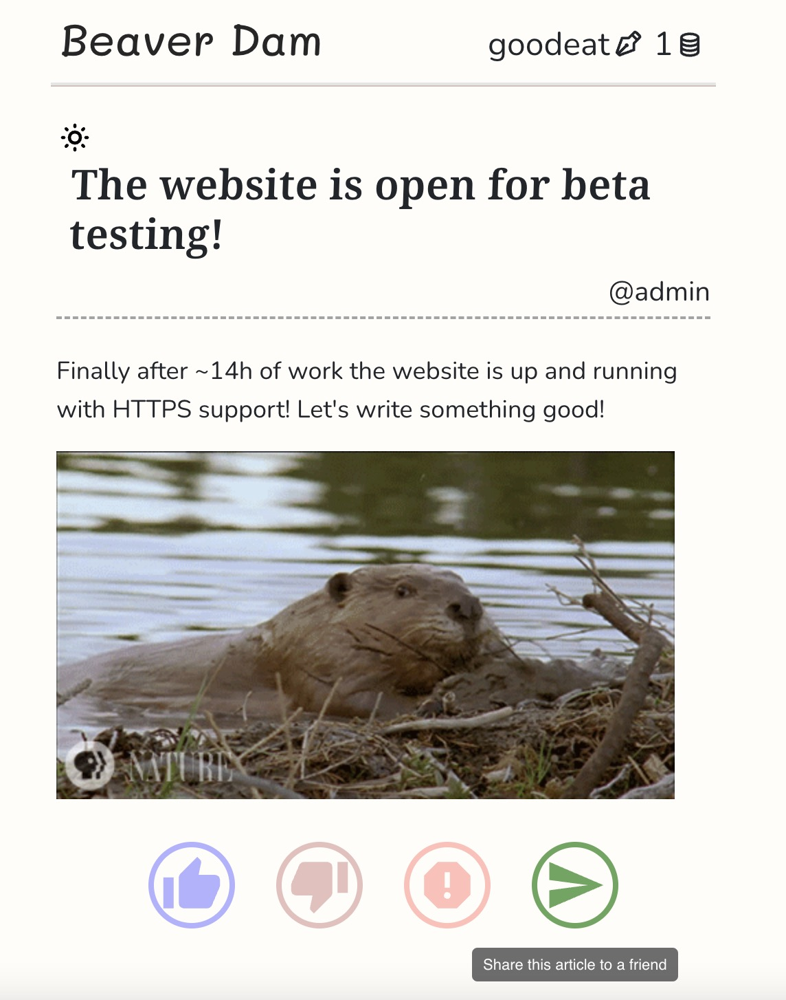

# Beaver Dam

You might read a lot. You follow the daily news. You follow the latest trends. You watch random youtube videos. But you don't feel like you learned a lot.

In Beaver Dam, you probably can't read a lot. But every day, we hope you'll get something new!

Learn about how to build a rocket, be amazed by a newly discovered species, or read a moving sci-fi story. All from the fellow beavers around you.

You get a new coin every day to read an article. Upvote to reward the author that coin, and share the article with others.

To gain more coins, consider becoming a helping beaver and post something interesting!

 You might read a lot. You follow the daily news. You follow the latest trends. You watch random youtube videos. But you don't feel like you learned a lot.

In Beaver Dam, you probably can't read a lot. But every day, we hope you'll get something new!

Learn about how to build a rocket, be amazed by a newly discovered species, or read a moving sci-fi story. All from the fellow beavers around you.

Beaver Dam, discover something new every day.

 

See Beaver Dam live at [https://beaverdam.top/](https://beaverdam.top/)

Developed for [HackMIT 2022](https://hackmit.org/)

## Authors 

Beaver Dam was made for HackMIT 2022, by Team **Elephanti** — Mingyang Deng, Ziqian Zhong. 

## Languages & Tools 

Beaver Dam was developed using the following technlogies:

- JavaScript 
- React.js
- Node.js
- MongoDB
- ... and more!

